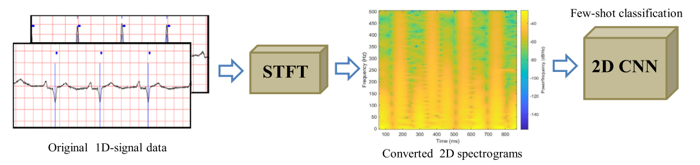
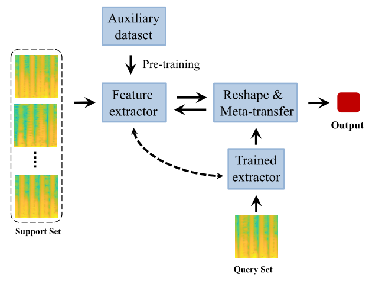

Typically, we use ECG signals to diagnose the type of cardiac arrhythmia. This classification problem could be solved with the help of machine learning methods. Nowadays wearable devices like smartwatches can track and report vital heart signs. However, most of them lack real-time disease prediction. For more intelligent health monitoring, we would like to employ ML methods on these edge devices. Constrained by the data storage of these devices,  we are facing a few-shot learning problem. 

First, we process the ECG signal into 2D spectrograms by using short-time Fourier transform (STFT).

Then we proposed a meta-transfer scheme.

