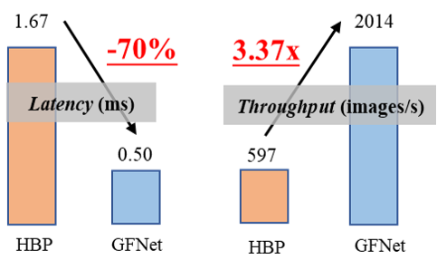
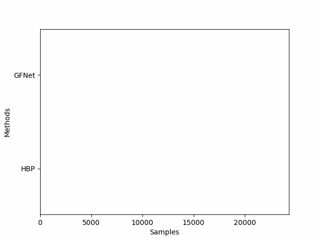

Due to the limited computational resources of the edge devices, the efficiency of ML methods is important for employment. The objective of improving computational efficiency is to reduce the average latency while maintaining accuracy. 

Our solution was employing an adaptive inference scheme with dynamic neural networks. For this 6-class image classification task on the training set of 467,781 images and validation set of 22,824 images, I employed the novel spatially adaptive inference framework, [GFNet](https://proceedings.neurips.cc/paper/2020/file/1963bd5135521d623f6c29e6b1174975-Paper.pdf), proposed by our Leap Lab. 

The framework glances at the whole image of small size (96*96) at first; then the algorithm will adaptively select important patches by reinforcement learning for further classification. If the score output by the classifier is higher than the predefined threshold, the sequence will be ended. This is called early-exit scheme.

Compared with the baseline model, Hierarchical Bilinear Pooling (HBP), used by the former service of China Mobile Inc., I reduced the average latency by 70% while maintaining the accuracy of 97.06% after programming the early-exit scheme for batch inference.

