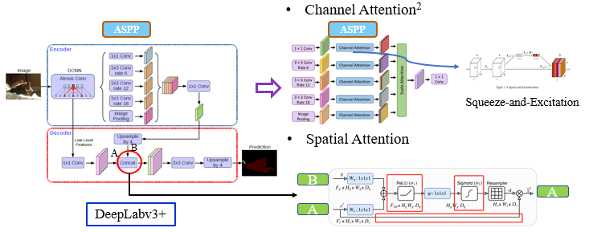
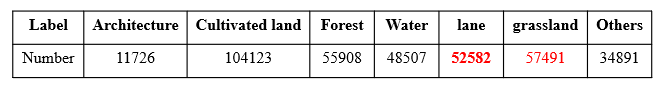
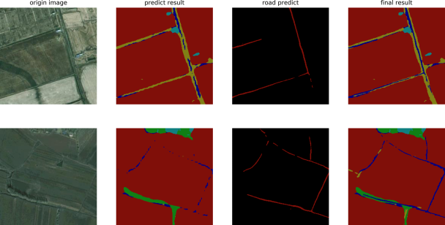

The theme of this competition is to segment remote sensing images and classify different parts into 7 types of landforms, such as lanes, water, or grassland. 

We adopted the powerful semantic segmentation method, DeepLabv3+ with the backbone of ResNet101 on the training dataset of 140,000 images and the testB set of 20,000 images.

For better generalization performance and representation power of the method, I added two types of attention blocks, channel attention and spatial attention, to focus on more task-relevant channels and spatial areas.

For tackling the class-imbalance problem, I used the weighted sum of the Weighted Cross-Entropy Loss and Lovasz Softmax Loss for training.

Besides, I also chose samples of minor classes, i.e., lane and grassland to construct independent U-Net -based binary classifiers and merged the results with the original predictions of the DeepLab model.

After using ensemble strategies, and adopting dilation and corrosion as post-processing steps, we ranked 9/116 on the Rank B board in the 1st Round and ended with 12/28 on the Rank B board in the 2nd Round.