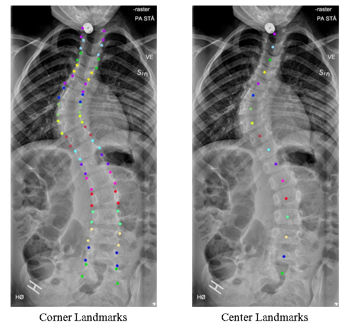

Normally, clinicians evaluate the curvature of the spine by calculating the Cobb angles for scoliosis diagnosis. They should identify vertebrae first and then select tilted ones for Cobb angle measurement. In order to relieve the burden of manual operation, we use machine learning methods to automatically detect vertebral landmarks.

As preliminary, we collected spine X-ray images from Peking University First Hospital and I annotated two types of landmarks, 68 corner landmarks and 17 center landmarks, on X-ray images. In total, we built a novel annotated spine X-ray dataset of more than 1000 samples.  The relevant paper has been submitted to *[Scientific Data](https://www.nature.com/sdata/journal-information)*. 

Then we employed our multi-scale keypoint estimation approach on this dataset. We published a conference paper on the *[Ubicomp/ISWC 2020](https://dl.acm.org/doi/abs/10.1145/3410530.3414317?casa_token=oZ2h0lvky8cAAAAA:4De6qYwKoZPtmtfntQ1fxUy-EFtzG1JDq6BMhm6tuZuQt7MGHBFJVjDRTfSKsgn8F1vZ-E5YPBAZWg4)* and the journal version has been accepted by the *[Artificial Intelligence In Medicine](https://www.sciencedirect.com/science/article/pii/S0933365721002281)*.