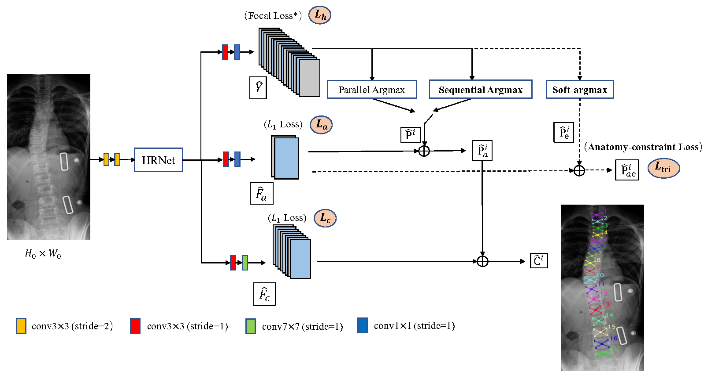
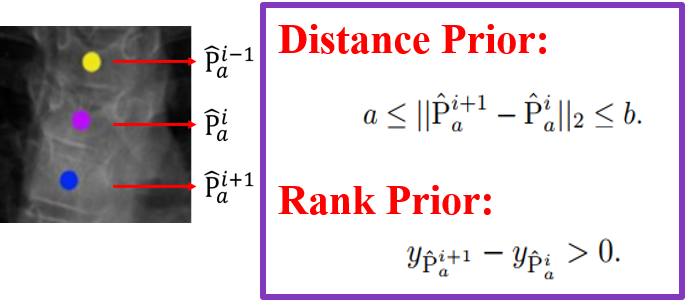
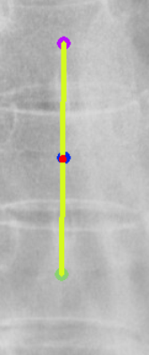
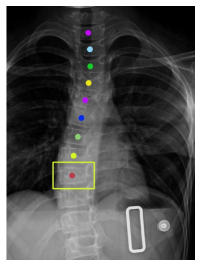
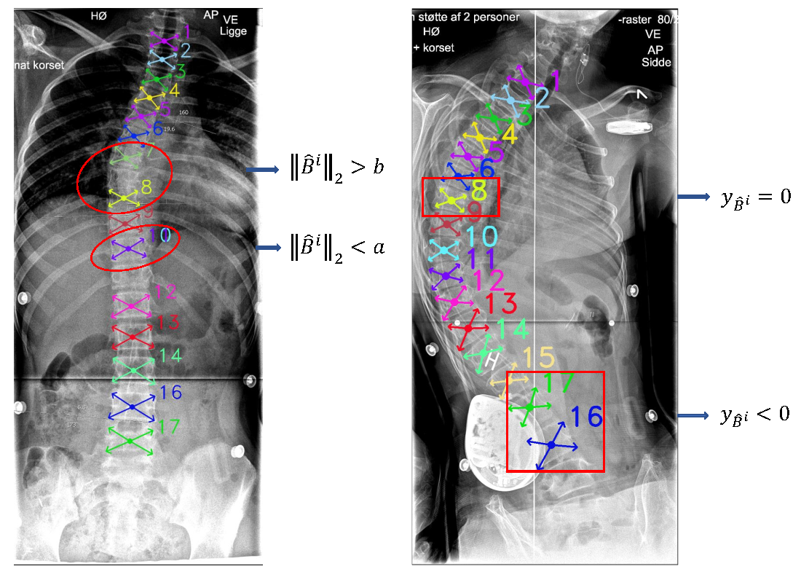
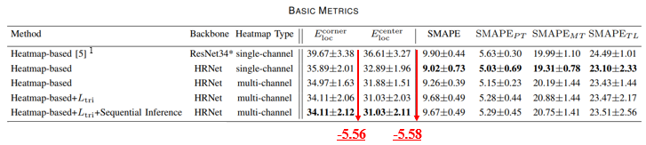
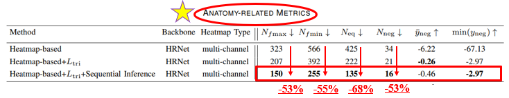

Normally, clinicians evaluate the curvature of the spine by calculating the Cobb angles for scoliosis diagnosis. They should identify vertebrae first and then select tilted ones for Cobb angle measurement. In order to relieve the burden of manual operation, we use machine learning methods to automatically detect vertebral landmarks.

As preliminary, we collected spine X-ray images from Peking University First Hospital and I annotated two types of landmarks, 68 corner landmarks and 17 center landmarks, on X-ray images. In total, we built a novel annotated spine X-ray dataset of more than 1000 samples.  The relevant paper has been submitted to *[Scientific Data](https://www.nature.com/sdata/journal-information)*. 

Then we employed our multi-scale keypoint estimation approach on this dataset. We published a conference paper on the *[Ubicomp/ISWC 2020](https://dl.acm.org/doi/abs/10.1145/3410530.3414317?casa_token=oZ2h0lvky8cAAAAA:4De6qYwKoZPtmtfntQ1fxUy-EFtzG1JDq6BMhm6tuZuQt7MGHBFJVjDRTfSKsgn8F1vZ-E5YPBAZWg4)* and the journal version has been accepted by the *[Artificial Intelligence In Medicine](https://www.sciencedirect.com/science/article/pii/S0933365721002281)*.

However, I found that some predicted landmarks disobeyed the anatomy of the spine. To solve this problem,  I tried to merge the anatomical prior knowledge into ML methods. 

For the basic architecture, I adopted a heatmap-based pose estimation algorithm with the powerful backbone network [HRNet](https://arxiv.org/abs/1908.07919). I utilized the three-head mechanism to attain landmarks. I calculated corner offset (using *F*c) with regard to center points after calibrating center land-mark predictions (using *F*a), which are extracted from the 17-channel center heatmap *Y*.

Firstly, I explicitly formulated two types of anatomical priors related to distance range and spatial order among landmarks. 

Then I incorporated this prior knowledge with the vanilla method by designing specialized training penalties and inference schemes.

* Anatomy-constraint Loss

Among the vertebra triplets, I constrained the center landmark of the middle vertebra close to the mid-point of the other two landmarks.

* Anatomy-aided Inference

I employ sequential inference. Similar to the autoregressive sequence prediction of language, each vertebral center landmark is generated based on the former predicted landmark. The feasible range R (yellow rectangle) of the current center landmark would be restricted according to the spatial relationship with the former center landmark prediction. 

\
Moreover, to emphasize the importance of anatomical plausibility for reliable clinical use, I provided novel anatomy-related metrics, calculating the numbers of vertebrae that disobey anatomical prior, beyond the widely-used localization error. 

Finally, I showed the effectiveness of designed components by performing extensive ablation studies. 

For anatomy-constraint loss:

 adding the anatomy-constraint loss")

For anatomy-aided inference:

 adding the anatomy-constraint loss (b) adding the anatomy-constraint loss and adopting the anatomy-aided inference")

I have submitted my paper to *[IEEE Transactions on Medical Imaging](https://ieeexplore.ieee.org/xpl/RecentIssue.jsp?punumber=42)*.